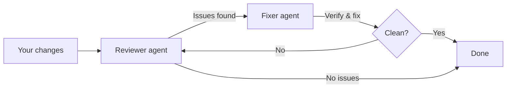

# Ralph Review

[](https://github.com/kenryu42/ralph-review/actions/workflows/ci.yml)
[](https://codecov.io/github/kenryu42/ralph-review)
[](https://github.com/kenryu42/ralph-review)
[](https://opensource.org/licenses/MIT)

Run review→fix cycles until your code is clean.

## How It Works

Ralph Review runs automated review cycles by pairing two AI agents — a **reviewer** and a **fixer**. The reviewer analyzes your changes and produces a structured list of issues. The fixer then independently verifies each finding against the actual code and applies fixes only where warranted. This repeats until the reviewer finds no issues or the iteration limit is reached.



The fixer doesn't blindly trust the reviewer — it reads the code, confirms each issue is real, and skips false positives. You can use different agents for each role (e.g. Claude reviews, Gemini fixes).

## Prerequisites

- [Bun](https://bun.sh) (runtime)
- [tmux](https://github.com/tmux/tmux) (background sessions)
- At least one supported agent CLI installed and authenticated

## Installation

```bash
npm install -g ralph-review
```

## Quick Start

```bash
# Auto-detect installed agents and configure reviewer/fixer
rr init

# Start a review cycle (runs in tmux)
rr run
```

`rr run` launches a tmux session so you can detach and keep working. Use `rr status` to check progress and `rr stop` to cancel.

## Commands

| Command | Description |
|---------|-------------|
| `rr init` | Configure reviewer, fixer, and simplifier agents (auto-detects installed CLIs) |
| `rr run` | Start review cycle in a tmux session |
| `rr run --base main` | Review changes against a base branch |
| `rr run --uncommitted` | Review staged, unstaged, and untracked changes |
| `rr run --commit SHA` | Review changes introduced by a specific commit |
| `rr run --max N` | Set max iterations |
| `rr run --simplifier` | Run a code-simplifier pass before review iterations |
| `rr config show` | Print full configuration |
| `rr config set KEY VAL` | Update a config value (e.g. `rr config set maxIterations 8`) |
| `rr list` | List active review sessions |
| `rr status` | Show current review status |
| `rr stop` | Stop running review session (`--all` to stop all) |
| `rr log` | View review logs (`-n 5` for last 5, `--json` for JSON output) |
| `rr dashboard` | Open review dashboard in browser |
| `rr doctor` | Run environment and configuration diagnostics (`--fix` to auto-resolve) |

The `rrr` command is a shorthand alias for `rr run` — all flags work the same.

## Supported Coding Agents

- [**Claude Code**](https://code.claude.com/docs/en/overview)
- [**Codex**](https://openai.com/codex/)
- [**Droid**](https://factory.ai/)
- [**Gemini CLI**](https://geminicli.com/)
- [**OpenCode**](https://opencode.ai/)
- [**Pi**](https://pi.dev)

## License

MIT
