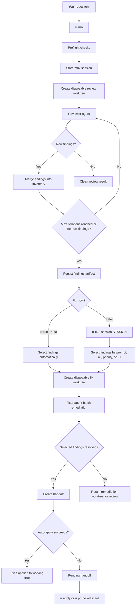

# Ralph Review

[](https://github.com/kenryu42/ralph-review/actions/workflows/ci.yml)
[](https://codecov.io/github/kenryu42/ralph-review)
[](https://github.com/kenryu42/ralph-review)
[](https://opensource.org/licenses/MIT)

Orchestrating coding agents for code review, verification, and fixing via the Ralph loop.

---

## Table of Contents

- [How It Works](#how-it-works)
- [Reviewer and Fixer Flow](#reviewer-and-fixer-flow)
- [Interactive Mode](#interactive-mode)
- [Prerequisites](#prerequisites)
- [Installation](#installation)
- [Quick Start](#quick-start)
- [Commands](#commands)
- [Supported Coding Agents](#supported-coding-agents)
- [Configuration](#configuration)
- [License](#license)

---

## How It Works

Ralph Review now uses a batch-first workflow:

1. `rr run` performs review only.
2. The reviewer runs in a disposable session worktree and reports structured findings.
3. Findings are deduplicated across review iterations and persisted as a session artifact.
4. If findings exist, you choose which ones to fix with `rr fix`.
5. The fixer handles the selected findings in a separate batch remediation phase.
6. Resolved fixes are handed back to your working tree, either automatically or as a pending handoff
   to apply manually.

This keeps review and remediation separate by default. The reviewer can focus on finding real
issues, and the fixer treats those findings as input for a later, explicit remediation step.

Use `rr run --auto` when you want Ralph Review to run remediation immediately after review. Add
`--priority P0,P1` to auto-fix only selected priority levels.

---

## Reviewer and Fixer Flow


```mermaid
flowchart TD
    A[Your repository] --> B[rr run]
    B --> C[Preflight checks]
    C --> D[Start tmux session]
    D --> E[Create disposable review worktree]
    E --> F[Reviewer agent]
    F --> G{New findings?}
    G -- Yes --> H[Merge findings into inventory]
    H --> I{Max iterations reached or no new findings?}
    I -- No --> F
    I -- Yes --> J[Persist findings artifact]
    G -- No --> K[Clean review result]
    J --> L{Fix now?}
    L -- Later --> M[rr fix --session SESSION]
    L -- "rr run --auto" --> N[Select findings automatically]
    M --> O[Select findings by prompt, all, priority, or ID]
    N --> P[Create disposable fix worktree]
    O --> P
    P --> Q[Fixer agent batch remediation]
    Q --> R{Selected findings resolved?}
    R -- Yes --> S[Create handoff]
    S --> T{Auto-apply succeeds?}
    T -- Yes --> U[Fixes applied to working tree]
    T -- No --> V[Pending handoff]
    V --> W[rr apply or rr prune --discard]
    R -- No --> X[Retain remediation worktree for review]
```

### Reviewer

The reviewer analyzes the selected review scope for correctness, security, reliability, and
maintainability issues introduced by the change. It outputs structured findings with stable IDs
such as `F001`, priorities `P0` through `P3`, and source locations.

Reviewer iterations continue until no new findings are discovered or `maxIterations` is reached.
By default the run stops early when an iteration finds nothing new. Use `--force` to run the full
iteration count.

### Fixer

The fixer runs only after findings have been persisted and selected. It receives the selected
finding inventory, works in a disposable fix worktree, and returns a per-finding result:
`resolved` or `unresolved`.

When all selected findings are resolved, Ralph Review creates a handoff. Depending on the working
tree state, the handoff may be applied automatically or left pending for `rr apply`. If selected
findings remain unresolved, Ralph Review keeps the remediation worktree available for inspection.

---

## Interactive Mode

Run `rr` with no command to open Interactive Mode. It shows active sessions, recent session history,
review output, findings, fix results, and handoff status.

Keyboard shortcuts:

| Key | Action |
|-----|--------|
| `r` | Start a new review session |
| `f` | Fix pending findings when a session has actionable findings |
| `s` | Stop a running review session |
| `l` | View session logs |
| `o` | Toggle the output drawer |
| `Tab`, `←`, `→` | Switch panel focus |
| `↑`, `↓`, `j`, `k` | Scroll the focused panel |
| `h`, `?` | Toggle help |
| `Esc`, `q` | Quit Interactive Mode without stopping reviews |

---

## Prerequisites

- [Bun](https://bun.sh) (runtime)
- [tmux](https://github.com/tmux/tmux) (background sessions)
- At least one [supported agent CLI](#supported-coding-agents) installed and authenticated

Ralph Review is a Bun-only TypeScript CLI. Use Bun for development and script execution.

---

## Installation

```bash
# Homebrew (install or update)
brew install kenryu42/tap/ralph-review

# npm (install or update)
npm install -g ralph-review

# Or let Ralph Review detect the install method and update itself
rr update
```

For update checks without installing, run:

```bash
rr update --check
```

If install-source detection is ambiguous, force the package manager:

```bash
rr update --manager npm
rr update --manager brew
```

---

## Quick Start

```bash
# Configure reviewer and fixer agents
rr init

# Start Interactive Mode
rr

# Start a review-only background session
rr run

# Review against a base branch
rr run --base main

# Review staged, unstaged, and untracked changes
rr run --uncommitted

# Review a specific commit
rr run --commit SHA

# Fix findings after review completes
rr fix --session SESSION_ID --all

# Review and immediately fix P0/P1 findings
rr run --auto --priority P0,P1
```

`rrr` is a shorthand alias for `rr run`. It starts a non-interactive review run without launching
Interactive Mode.

---

## Commands

| Command | Description |
|---------|-------------|
| `rr` | Launch Interactive Mode |
| `rrr` | Alias for `rr run` |
| `rr init` | Configure reviewer and fixer agents |
| `rr init --global` | Write the user-global config |
| `rr init --local` | Write repo-local overrides to `.ralph-review/config.json` |
| `rr run` | Run review only and persist findings for later fixing |
| `rr run --base main` | Review changes against a base branch or ref |
| `rr run --uncommitted` | Review staged, unstaged, and untracked changes |
| `rr run --commit SHA` | Review changes introduced by a specific commit |
| `rr run --max N` | Set max review iterations |
| `rr run --force` | Run all configured iterations even if no new findings appear |
| `rr run --auto` | Run remediation immediately after review completes |
| `rr run --auto --priority P0,P1` | Auto-fix only findings with matching priorities |
| `rr run --sound` | Play a completion sound for this run |
| `rr run --no-sound` | Disable the completion sound for this run |
| `rr fix --session SESSION` | Fix selected findings from a persisted review session |
| `rr fix --session SESSION --all` | Select all persisted findings for remediation |
| `rr fix --session SESSION --priority P0,P1` | Select findings by priority |
| `rr fix --session SESSION --id F001 --id F003` | Select findings by ID |
| `rr apply` | Apply a pending review handoff |
| `rr apply --session HANDOFF` | Apply a specific pending handoff |
| `rr prune` | Prune orphaned review session artifacts |
| `rr prune --dry-run` | List prunable artifacts without deleting them |
| `rr prune --discard --session HANDOFF` | Discard a pending handoff |
| `rr list` / `rr ls` | List active review sessions |
| `rr stop` | Stop a running review session |
| `rr stop --all` | Stop all running review sessions |
| `rr log` | View the latest review log for the current project |
| `rr log -n 5` | View the last 5 review logs |
| `rr log --json` | Print current-project review logs as JSON |
| `rr log --json --global` | Print review logs across all projects as JSON |
| `rr doctor` | Run environment and configuration diagnostics |
| `rr doctor --fix` | Auto-resolve supported diagnostic issues |
| `rr update` | Check for and install a newer version |
| `rr update --check` | Check for a newer version without installing |

You can append one positional custom instruction to `rr run` when an explicit review target is
selected:

```bash
rr run --base main "focus on security boundaries"
```

---

## Supported Coding Agents

| Agent | Link |
|-------|------|
| Claude Code | https://code.claude.com/docs/en/overview |
| Codex | https://openai.com/codex/ |
| Droid | https://factory.ai/ |
| Gemini CLI | https://geminicli.com/ |
| OpenCode | https://opencode.ai/ |
| Pi | https://pi.dev |

You can assign different agents and models to the reviewer and fixer roles. For example, Codex can
review while Claude or Gemini fixes.

---

## Configuration

Run `rr init` to create configuration. Ralph Review supports a user-global config and repo-local
overrides:

- Global config: `~/.config/ralph-review/config.json`
- Repo-local overrides: `.ralph-review/config.json`

By default, `rr config show` displays the effective merged configuration for the current project.

```bash
# View effective configuration
rr config show

# View raw JSON
rr config show --json

# View only repo-local overrides
rr config show --local

# View one value
rr config get reviewer.agent

# Update global configuration
rr config set maxIterations 8

# Update repo-local configuration
rr config set --local defaultReview.branch main

# Edit configuration in $EDITOR
rr config edit
rr config edit --local
```

Useful settings include:

| Key | Purpose |
|-----|---------|
| `reviewer` | Agent, model, and reasoning used for review |
| `fixer` | Agent, model, and reasoning used for remediation |
| `maxIterations` | Maximum reviewer iterations per run |
| `iterationTimeout` | Per-agent timeout in milliseconds |
| `defaultReview` | Default review target, such as uncommitted changes or a base branch |
| `notifications.sound.enabled` | Completion sound preference |

Run `rr doctor` to verify that your environment and configuration are valid. Add `--fix` to let it
auto-resolve supported issues.

---

## License

MIT
